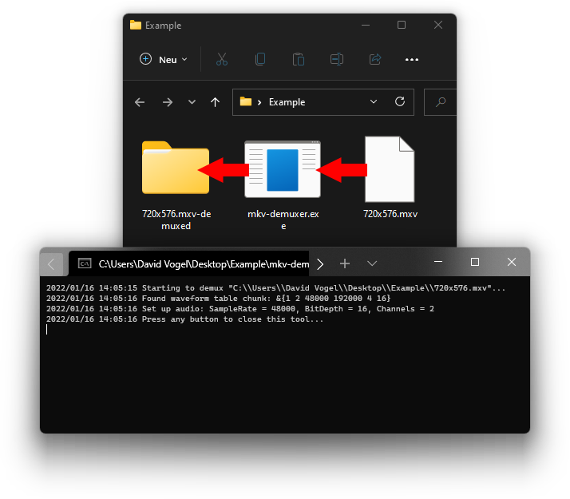
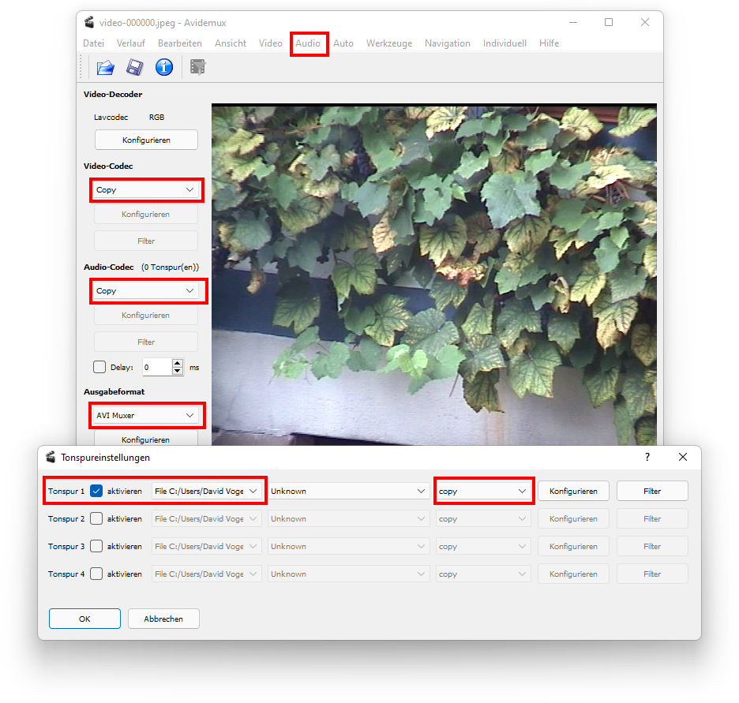

# mxv-demuxer

A simple tool to demux ".mxv" (MAGIX Video) files.

This program extracts all video frames and audio samples from mxv files.
It doesn't convert or transcodes anything, so there is no loss in quality in the process.
What you get is the pure/raw series of JPEGs and PCM audio data that is contained in mxv files.

You then can use Avidemux, or any other software you like, to write this data into another container that can be read by other video software.
This, too, can be done without any loss in quality.
A detailed explanation is given below.

I tested this tool on video material from:

- MAGIX Video Deluxe 2007/2008
- MAGIX Video Pro X5

## Reason for its existence

If you have ever used some older (or even newer) video-editing software from MAGIX, you may have created one or more mxv video files.
These files contain audio and video data from frame grabbers or other sources, so they most likely contain old recordings from camcorder videotapes or screen recordings.
The problem is that no other software can read mxv files, so you are stuck with using MAGIX video-editing software.

Assuming you can't re-record your tapes into a future-proof format, you are stuck with MAGIX's proprietary format.
Without this tool, the only way to convert your video recordings is by exporting them with some MAGIX video-editing software.
This comes with the following disadvantages:

- You still need to have such software, and you still need a working license for them (Some encoders must be activated online).
- You have to use their software to do the transcoding.
- Depending on the encoder and quality level, transcoding may be slow.
- You can't transcode them without loss of quality. (Maybe that's possible in newer MAGIX software versions, i couldn't check).

## Usage

- Download the executable from the [latest release](https://github.com/Dadido3/mxv-demux/releases/latest).
- Move the executable `mxv-demux.exe` into a folder with your mxv-files.
- Run `mxv-demux.exe`.
- The tool will create new folders for every mxv-file it encounters:
  - `Example.mxv` will be demuxed into a directory called `Example.mxv-demuxed`.

Alternatively, you can just drag and drop one or multiple files onto the executable.
The results will be written into the same directory as the source files.

## Re-muxing into another container

This is just an example how to repackage the video and audio data into another container.
Theoretically you could import the JPEG sequence and audio stream into your video-editing software of your choice, if it supports that.

- Download, install and start [Avidemux](http://avidemux.sourceforge.net/download.html).
- Drag and drop the first JPEG frame into Avidemux.
- Open `Audio` -> `Select Track`, select the extracted wav file, if there is any.
- Set everything to `copy`, set the output format to `AVI Muxer`.
- Hit `File` -> `Save`, done.

The result should be a 1:1 copy of your mxv data, but in a usable container.
If the audio and video stream run out of sync after some time, you probably need to adjust the video frame rate in Avidemux.
I can't be bothered to check right now how to do that, Avidemux is a bit quirky in this regard.

