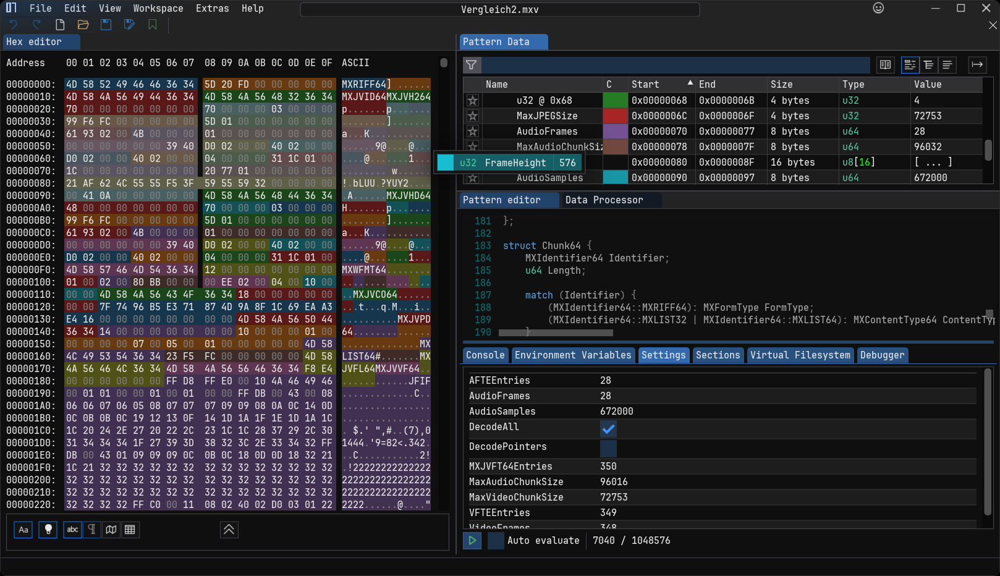

# Reverse engineering

The pattern file [mxv-container.hexpat](./mxv-container.hexpat) contains the current state of my reverse engineering effort.
The file can be used with [ImHex] to inspect any MXV file:

## Format basics

It's a really simple video format, as it is just a bunch of JPEG images and PCM audio data stored in some relatively simple data structures.
Theoretically (and practically) you can grab the JPEG and PCM data without modifying it, put it into another container (like AVI), and then be able to play it back with non MAGIX software.
And that without losing any image/sound quality, as there is no transcoding or re-encoding happening.
And that's basically what this project is about.

The structure of a MXV container is similar to [RIFF].
The difference is that most fields like the identifiers and lengths have a width of 64 bits, which makes sense as this container likely contains video data larger than 4GiB.

The root chunk has an identifier of `MXRIFF64`.
The `FormType` of the root chunk describes the type of data this container holds.
My test video files all have it set to `MXJVID64`, but it's likely that MAGIX also uses this container for other purposes.
For MXV files it's most likely always set to `MXJVID64`.

The root chunk has the following sub-chunks:

- `MXJVH264`: This contains information about the number of video and audio frames, the video resolution, and some unimportant and/or unknown data.
- `MXJVHD64`: Same as `MXJVH264`, but shorter.
  Likely from an older version, and it may just be there for compatibility reasons.
  It's also missing all of the audio information.
- `MXMFMT64`: Wave format stuff. Like sample rate, number of channels, ...
- `MXJVCO64`: Unknown.
- `MXJVPD64`: Unknown.
- `MXLIST64`: A list of sub-chunks with `ContentType` set to `MXJVFL64`.
  It contains all video and audio frame chunks.
  There may be fewer frames listed here than the real count of video frames, as the format can deduplicate frames.
- `MXJVFT64`: Contains an array of file offsets to all video frame chunks.
  There is one more entry than there are frames.
  But this is most likely there due the need to calculate the chunk length, as the array only stores offsets.
  Multiple entries here can point to a single frame chunk.
- `MXLIST32`: A list of sub-chunks with `ContentType` set to `MXJVTL32`.
  It contains file offsets and byte lengths of all video and audio frame chunks.
  Multiple entries here can point to a single frame chunk.

The correct way to decode/read video frames is to iterate over the `MXJVTL32` list or the `MXJVFT64` chunk.
Using `MXJVFL64` directly will result in fewer frames and therefore video/audio sync issues.
This is because `MXJVFL64` is only a storage container for the video and audio frames, the correct order and number of times a frame is shown is stored in `MXJVTL32` and/or `MXJVFT64`.
Theoretically the frame data in `MXJVFL64` could be written out of order, and still be played back fine as long as `MXJVTL32` and/or `MXJVFT64` point to the correct chunks.

## How can i help?

If you have some MAGIX video editing software you can provide small synthetic test video files varying by the following parameters:

- Framerate
- Pixel aspect ratio
- Audio sample rate
- Audio channels
- Audio bit depth
- Or anything else you can think of

With that i would be able to extend the support of these features.

Also, you can use [ImHex] to inspect files yourself, and check them against info that you can obtain from your MAGIX video software.

Feel free to open a new issue if you find any discrepancies in the current documentation or have any helpful information.

## Old grammar file

[MXV Container.grammar](./MXV%20Container.grammar) is a grammar file made with [hexinator] that helps to decode and inspect MXV files.
It's also be compatible with [Synalyze It!].

As i don't have access to a full version of hexinator or similar software, i'll not continue to work on `MXV Container.grammar`.

[ImHex]: https://imhex.werwolv.net/
[hexinator]: https://hexinator.com
[Synalyze It!]: https://www.synalysis.net/
[RIFF]: https://en.wikipedia.org/wiki/Resource_Interchange_File_Format
